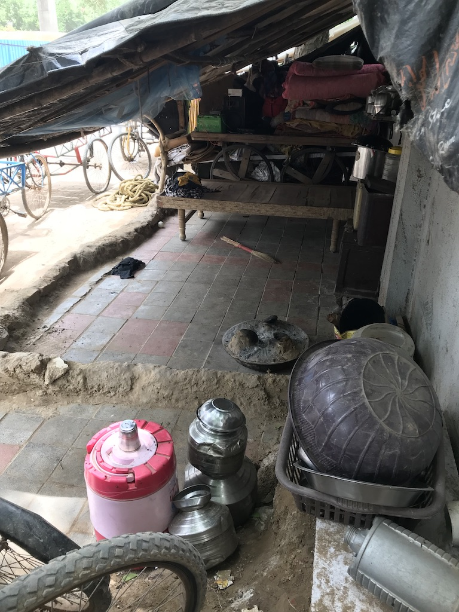
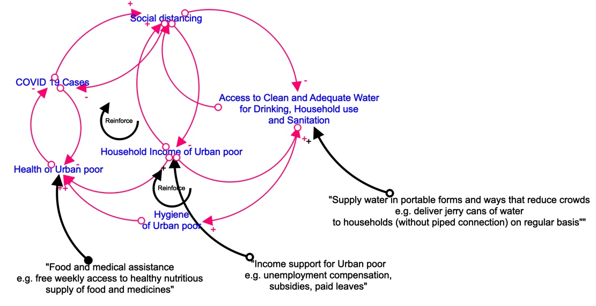

Today, on the World Water Day 2020, I cannot stop thinking about how millions of Indians living in poverty and informal settlements in cities will protect themselves from COVID-19.

*- Vaishali Kushwaha*

---

Today is Day 10 of [social distancing](https://en.wikipedia.org/wiki/Social_distancing) for me. I am currently living in a quaint town of Brookline in Massachusetts, USA. My residence is adjoining Boston, and my office is in Boston - a hub of COVID-19 outbreak - hence the threat is real. However, I have comfortably transitioned to a life of work/study/stay-at-home. I have been successfully following the [WHO guidelines](https://www.who.int/emergencies/diseases/novel-coronavirus-2019/advice-for-public) of washing my hands frequently and maintaining social distance. This is because I have access to 24/7 clean water, nutritious food, clean house, and regular income. 

Today, on the World Water Day 2020, I cannot stop thinking about how millions of Indians living in poverty and informal settlements in cities will protect themselves from COVID-19. Today, India also experimented with [*Janta (People's) Curfew*](https://www.livemint.com/news/india/janata-curfew-india-embraces-social-distancing-to-fight-novel-coronavirus-11584855677816.html) and my hometown, Ahmedabad, along with three other major cities of Gujarat, went on partial [lockdown till March 25](https://www.livemint.com/news/india/coronavirus-ahmedabad-surat-rajkot-vadodara-under-lockdown-until-25-march-11584845093709.html). Though the verdict on the nation-wide one-day social distancing effort has not yet been out, WhatsApp messages are already trolling people who gathered in groups to clap and bang *thalis*. People might have forgotten the essence of social distancing in their expression of gratitude and solidarity for essential service providers. I wonder what will happen when this *Junta (People's) Curfew* will extend to weeks and months and people will go out to seek essential services for themselves – like water, food, medicines, and daily wages!

‘Wash your hands frequently’ is the first and most basic protective measure against COVID-19. Washing hands needs water, a dear commodity for the urban poor in India. As per the last [Census](http://censusindia.gov.in/DigitalLibrary/TablesSeries2001.aspx)(in 2011), only about 62% of urban households in India had access to tap water from a treated source, and nearly 38% of urban households did not have access to a municipal water supply. Moreover, of these 62% of households, only 49% had access to piped water supply within their premises. Therefore, 13% of the population that had access to municipal/treated water sources was collecting it from sources outside their houses. Lack of clean and adequate water for drinking, household use, personal hygiene, and sanitation has been a consistent concern in rapidly growing Indian cities. This shortcoming will further put the urban poor to a higher risk of getting and spreading COVID-19 virus.

| 
Photo 1:Water storage in urban slums. | Photo 2:Street-side dwellers and their water storage.

A simple [causal loop diagram](https://en.wikipedia.org/wiki/Causal_loop_diagram) highlights the nexus of water, social distancing, and COVID-19 in context of Indian cities (Figure 1). It highlights the vulnerability of marginalized communities that lack a safe/adequate water supply. As the cases of COVID-19 in India will rise, the guidelines for social distancing will become tighter and lock downs will become longer. Social distancing will impact ways urban poor collect water. Urban poor without access to piped water within their premises often use community taps. These taps usually get water only for a few hours in morning and evening, resulting in long queues and crowds of people eager to collect water. Similarly, in locations where water is supplied through municipal water tankers residents rush in crowds to get few buckets of water. 

**Figure 1. Water - COVID-19 – Social Distancing Nexus: Leverage points for intervention**

All out-of-premises water sources result in crowds and will result in spread of COVID-19. In such cases city municipalities will need to reconsider the water delivery mechanisms. An option that fulfills social distancing guidelines is to deliver water in portable form to individual households that lack piped water supply. For instance, rather than sending one large water tanker, municipality can supply water bottles for drinking purposes and large barrels or jerry cans for handwashing and household use. For an immediate and large-scale implementation, local governments can partner with the private water suppliers which already have bottles, barrels, jerry cans, and transportation. Moreover, municipalities should also discontinue community taps and replace it with household water delivery options. If they cannot, then a more acceptable alternative will be to run community taps 24/7 and spread out the collection of water across the day. This option will also require strict policing and crowd management by community representatives.

Moreover, social distancing will disproportionately impact the urban poor’s access to work and regular income. Urban poor spend a large portion of their daily wages on buying basic food, water and medicines. Each day that they are asked not to work, their income dwindles, and their health and hygiene fall in jeopardy, making them susceptible to COVID-19. In order to survive, urban poor will go out seeking work, break the social distancing norms and put the larger community at risk. Government, civil society, private sector, NGOs, households, and individuals can support them in two ways: (1) provide monetary support in terms of paid leave, unemployment compensation, subsidies, etc. (2) provide a weekly supply of free food, drinking water and medical supplies.

COVID-19 and social distancing are bound to change the way societies and countries function. **It is very important to remember that as an interconnected society and city we are only as strong as our weakest link.** Evidence from across the world validates that no amount of money and convenience will stop rich and powerful from getting COVID-19; however, ensuring adequate water, food, and income to support good hygiene and health of the poorest of poor will fortify our cities in the fight against this novel virus.

Being 10 days ahead in social distancing, a reckoning of social inequalities and tipping of healthcare systems, I can assure you that COVID-19 is going to demand much more solidarity from Indians than just banging *thalis*. The government alone cannot fight this war. So please look out for the poor and vulnerable you employ, or you might know. Promote social distancing, not social inequality - share your food, water, money and blessings! 

P.S. – India will have to pump up production of hand sanitizer, not only for medical facilities but also as a back-up for people with limited access to water. Nevertheless, [washing hands](https://www.who.int/gpsc/5may/Hand_Hygiene_Why_How_and_When_Brochure.pdf) with soap and water is still considered superior to using hand sanitizers.

**March 23, 2020 Update:** Experts now agree that **[physical distancing](https://www.ctvnews.ca/health/coronavirus/why-health-officials-say-physical-distancing-is-a-better-term-than-social-distancing-1.4863344) is a better term than "social distancing"**. Remianing physically distant is absolutely essential, but it does not mean we socially disconnect ourselves from family, friends or community.

**March 24, 2020 Update:** Today, the Indian Prime Minister Narendra Modi announced a [nation-wide lockdown for 21-days](https://time.com/5808348/india-coronavirus-lockdown/). Soon after the *Junta (People's) Curfew*, a 14 hours voluntary shutdown, the central government asked 1.3 billion Indian's to stay home and non-essential services to closed down for 21 days. 
