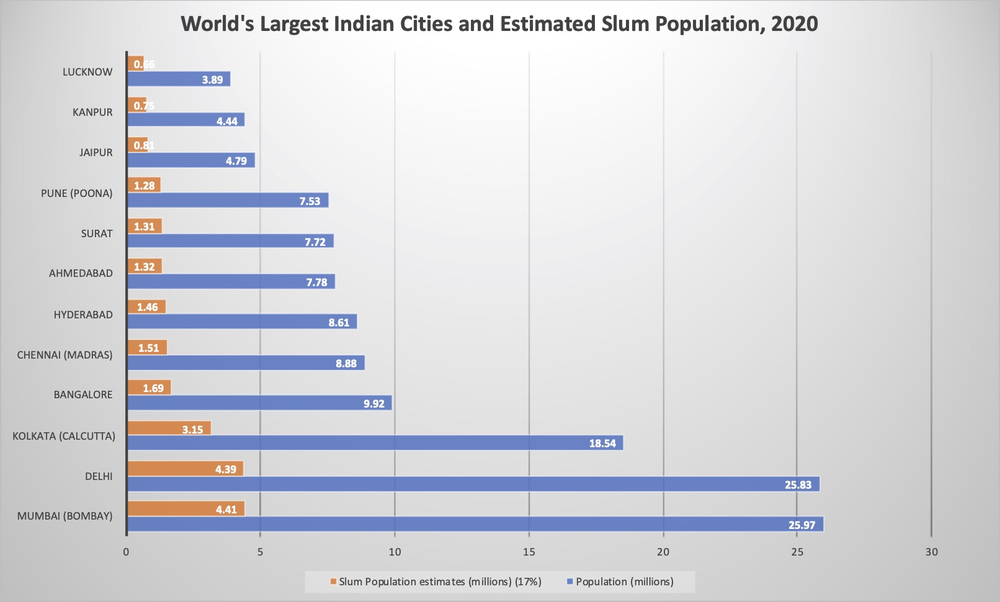
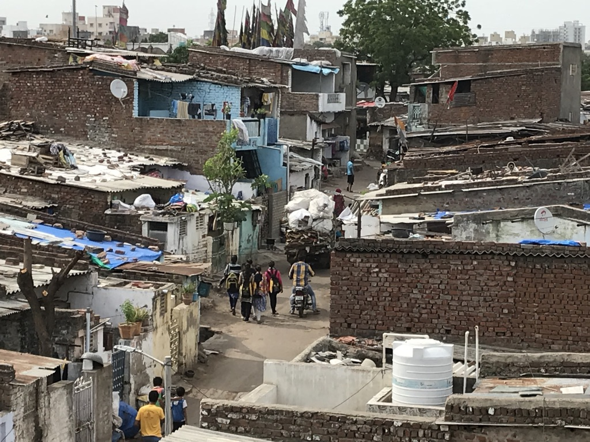
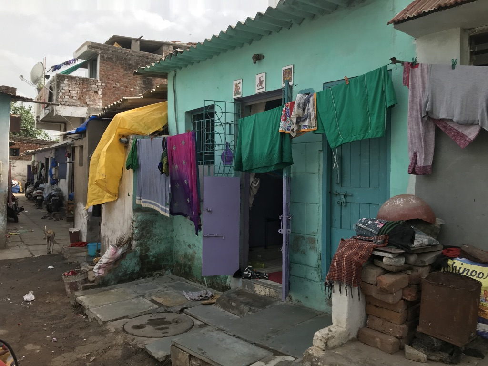
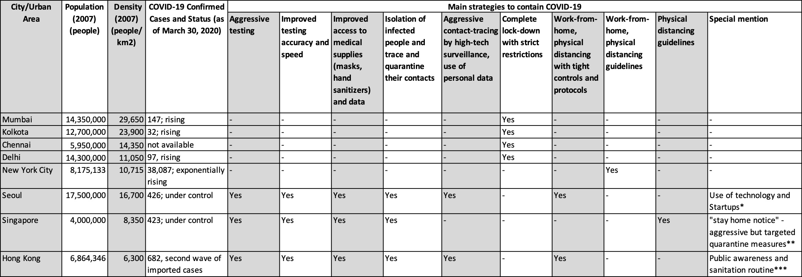

WHO recommends to ‘maintain at least 1 meter (3 feet) distance between yourself 
and anyone who is coughing or sneezing.’ Governments have translated this into stay-at-home 
and avoid crowd policies. But what should one do when home itself is crowded place? 

*- Vaishali Kushwaha*

---

Happy April Fool’s day! Today, my family diligently completed 20 days of physical distancing. 
However, let’s not fool ourselves that this is going to end anytime soon. [New York is under siege](https://www.nytimes.com/2020/04/01/nyregion/coronavirus-new-york-update.html?action=click&module=Spotlight&pgtype=Homepage), 
Massachusetts (my current residence) will be hitting its [peak in the next 2 weeks](https://www.nbcboston.com/news/coronavirus/researchers-predict-coronavirus-surge-in-massachusetts-new-england/2099748/), 
and hometown of Ahmedabad has been just declared one of the [10 hotspots in India](https://economictimes.indiatimes.com/news/politics-and-nation/indias-10-covid-19-hotspots-an-overview/articleshow/74928317.cms). 
It’s the [World War III that Bill Gates predicted!](https://www.ted.com/talks/bill_gates_the_next_outbreak_we_re_not_ready)

The current war against COVID-19 virus has once again brought to light the striking social, economic and
environmental inequities in our society. 
In this pandemic where physical distancing has emerged as a key protective measure, urban poor are once again at odds and are unable to protect themselves. 
[WHO recommends](https://www.who.int/emergencies/diseases/novel-coronavirus-2019/advice-for-public)
to '**maintain at least 1 meter (3 feet) distance** between yourself and anyone who is coughing or sneezing.' 
Indian government, like most others, have translated this into stay-at-home and avoid-crowded-places policies. **But what should one do when home itself is a crowded place?**

Slums by definition are dilapidated, overcrowded residential areas characterized by lack of insufficient living space, lack of access to clean water, inadequate sanitation and insecure tenure[^1]. The 2011 Census reported India’s slum population as 65.5 million (6.5 Crore), which was around 17% of country’s urban population.  
If we consider the current estimated population of 1.3 billion, of which 35% or 455 million live in cities, and of which a conservative 17% still reside in slums. 

> **This converts to an estimated 77 million (7.7 crore) urban poor currently living in the slums of Indian cities which makes for 6% of the population of India that is at extremely high risk of infection**
 
as [India edges towards Stage-3 of COVID-19, i.e. community transmission stage](https://economictimes.indiatimes.com/news/politics-and-nation/covid-19-new-sop-by-health-ministry-states-indias-current-phase-as-local-transmission-and-limited-community-transmission/articleshow/74884816.cms).

To realize the magnitude of the issue it is important to understand that Indian cities are some of the most populated and densest in the world. 
Twelve of its cities and urban areas rank within the top 100 largest cities of the world (Figure 1). Mumbai and Delhi, megacities of India, are the 2nd and 3rd largest urban agglomerations in the world, with population density ranging from as high as 29,650 persons per sq. km in Mumbai to 11,040 persons per sq. km in Delhi. 
Slums in Indian cities are even more densely populated, with some areas in Mumbai being as high as 92,000 persons per sq. km[^2]. 

> **How much can physical-distancing or social-distancing help in limiting the spread of COVID-19 in places where a whooping 92 people have to share a square meter of space!**

**Figure 1. World’s Largest Indian cities and urban areas (Within top 100) in 2020 and Estimated Slum Population** -- [data-Source](http://www.citymayors.com/statistics/urban_2020_1.html)

| 

**Figure 2: Slums of India -- Ramapir in Chali, Ahmedabad, India**

A close example of constrained living spaces, narrow pathways, and crowded streets is New York City (NYC). 
I am aware of the stark economic difference between the two comparisons, but my focus is on understanding how other densely populated cities/neighborhoods are faring the COVID-19 fight. 
NYC has a density around 10,726 people per sq. km ([27,781.2 people per square mile](https://www.census.gov/content/dam/Census/library/publications/2015/demo/p25-1142.pdf)), which is far lower than any slum settlement or even an Indian metropolitan city. 
Nevertheless, New York’s current status as the epicenter of COVID-19 outbreak in the US is being linked to its [high density living](https://www.nytimes.com/2020/03/23/nyregion/coronavirus-nyc-crowds-density.html). Though New York tried to slow the spread of COVID-19 by closing schools, nonessential businesses and urging New Yorkers to stay home – this alone could not stop the exponential growth of COVID-19 infections. As of March 30, NYC’s COVID-19 confirmed cases were over 38,000 and exponentially rising. 

Even if India continues its national-level lockdown, this strategy alone will not stop the spread of COVID-19. 

> **Lockdown is only buying us the time to prepare for what is coming next and given the current state of preparedness in Indian cities – it will be a tsunami of COVID-19 positive cases.**

However, NYC is not the only high-density city around the world which has been impacted by this pandemic. 
Asian cities, Seoul, Hong Kong and Singapore, have emerged as [the best practices for COVID-19 control under high density living](https://www.bloomberg.com/opinion/articles/2020-03-30/new-york-is-coronavirus-hot-zone-but-not-because-of-urban-density). 
Seoul, with its 16,700 person per sq. km density is closer to Indian cities. I compared these large, dense cities, their COVID-19 response strategies and their outcome (Table 2) and found that density alone will not determine fate of Indian cities or it’s slum population. 
For high density spaces, in addition to physical distancing, 
> **(1) Aggressive testing, 
(2) Improved testing accuracy and speed, 
(3) Improved access to medical supplies (masks, hand sanitizers) 
(4) Isolation of infected people, 
(5) and data to trace and quarantine their contacts, are key to [‘flattening the curve’](https://www.nytimes.com/article/flatten-curve-coronavirus.html).**

**Table 1. Comparison of Key Cities: Density and Strategies to contain COVID-19** 
[Sources: City Population and Density](http://www.citymayors.com/statistics/largest-cities-density-125.htmlfrom)

Currently, local governments in most Indian cities are busy implementing the lock down, managing migrant worker’s exodus and finding ways to deliver food to its residents. 
Many are busy tackling the present and not preparing for the future. COVID-19 is a very aggressive and sneaky virus, and if city governments fail to predict, plan and tackle the infection at early stages – it will spread across all Indian cities. 
After synthesizing best and worse planned responses around the high-density cities hit by COVID-19 and analyzing the slum area and high-density neighborhood conditions, 

**I strongly recommend that Indian cities should immediately start building temporary isolation wards.**
Current COVID-19 guidelines in the US suggest care for yourself at home and seek medical attention when emergency signs develop. This was done to avoid overcrowding and subsequent failure of health facilities. 
But combined with delayed and lack of aggressive testing, slow contact tracing, and slack in physical distancing, this recover-at-home policy has only added to the community spread of the disease. On the contrary, all the successful Asian cities practiced stringent isolation of infected people (symptomatic and asymptomatic), rapid tracing and home quarantine of their contacts.

> **In high density slums and neighborhoods where space is a luxury, isolating the infected person (symptomatic and asymptomatic), away from their tiny houses and densely populated communities is the only way to control the spread.**

NYC experience shows that even when admitting only severe cases, beds and wards in public and private hospitals run out within the first few weeks. Hence, Indian city officials need to start identifying existing structures that can be rapidly converted into isolation wards. 
Indian government’s [out-of-box thinking of converting train coaches](https://www.bloomberg.com/news/articles/2020-03-31/oldest-asian-railway-turns-coaches-into-india-isolation-wards) into hospitals on wheels for rural and stressed hotspots is an excellent alternative.

> **However, at city-level college hostels, dormitories, hotels, convention centers, multi-purpose halls etc. are some of the built spaces that have water, electricity and basic amenities and hence can be rapidly converted into isolation wards.** 

The US Corps of Engineers is developing site assessment and design/modification guidelines for [alternate care sites](https://www.usace.army.mil/Coronavirus/Alternate-Care-Sites/), and Indian cities can also do the same. NYC is also building an [emergency hospital in Central Park](https://www.nbcnewyork.com/news/local/new-york-city-builds-emergency-field-hospital-in-central-park/2349804/) in order to cope with the rising number of COVID patients who need emergency care. A similar option for Indian cities would be to start setting up tents and makeshift medical care sites in public grounds, cricket fields, open exhibition and conference venues etc.

India’s medical resources (and monetary capacity) are nowhere close to those of the US, China, South Korea or Singapore. 
Hence we do not have the luxury of making mistakes and ramping up the efforts at the last moment. Mumbai, Delhi, Ahmedabad and Pune were today identified as hotspots in India. 
COVID-19 cases in these hotspots have started increasing rapidly. 

> **If Indian cities really want to stay ahead in the war against COVID-19, it has to aggressively plan and prepare for what’s coming next.** 

We should rapidly learn and customize strategies that have been successful in comparable cities. Government, with support from the private sector and civil society, needs to provide free COVID-19 testing, personal protection supplies (masks, hand sanitizers, hand soaps, water in portable containers, cleaning products etc.) and access to isolation units to the vulnerable urban poor.

[^1]: “Slums are those residential areas where dwellings are in any respect unfit for human habitation by reasons of dilapidation, overcrowding, faulty arrangements and designs of such buildings, narrowness or faulty arrangement of streets, lack of ventilation, light, sanitation facilities or any combination of these factors which are detrimental to safety, health and morals.” – Ministry of Housing and Urban Affairs, [Handbook of Urban Statistics 2019](http://mohua.gov.in/pdf/5c80e2225a124Handbook%20of%20Urban%20Statistics%202019.pdf)

[^2]: [Density estimates for Mumbai’s](https://www.hindustantimes.com/mumbai-news/does-dharavi-in-mumbai-have-a-million-residents/story-rAsCWDqsU86dpW9NhoMcJP.html) G North municipal ward, that houses the world-famous Dharavi slum, is around 66,000 persons per sq. km. Whereas, the most crowded municipal ward in Mumbai is Ward C with whooping density of around 92,000 per sq. km.

### References:

[1] [Table-1: Use of Technology and startups](https://www.techinasia.com/korea-response-covid19-praised-startups-helped)

[2] [Table-1: "stay home practices" -- Agressive but targeted quarantine practices.](https://www.statnews.com/2020/03/23/singapore-teach-united-states-about-covid-19-response)

[3] [Table-1:Public awareness and sanitation](https://www.statnews.com/2020/03/26/coronavirus-hong-kong-resurgenece-holds-lesson-defeating-it-demands-persistence)
