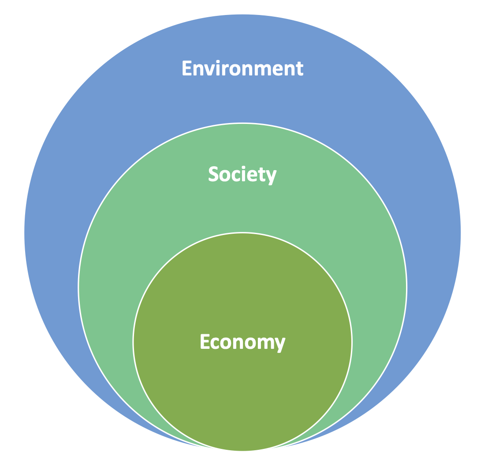
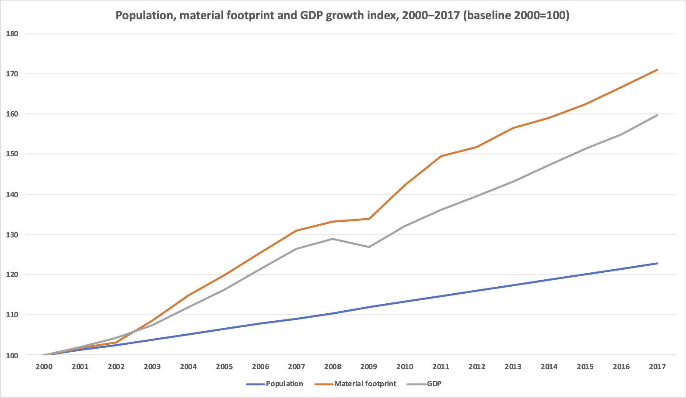
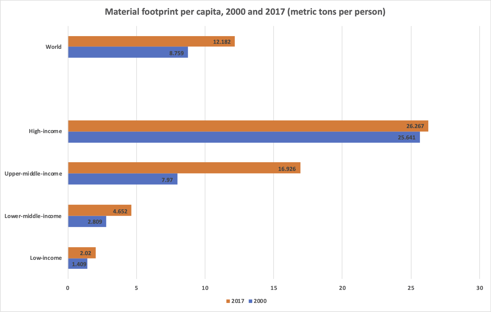
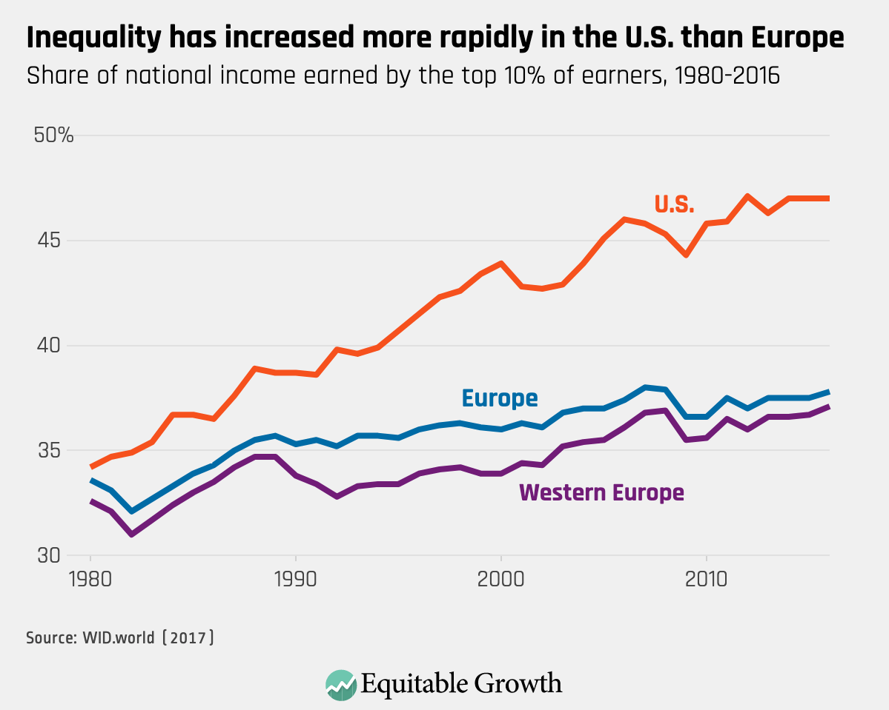
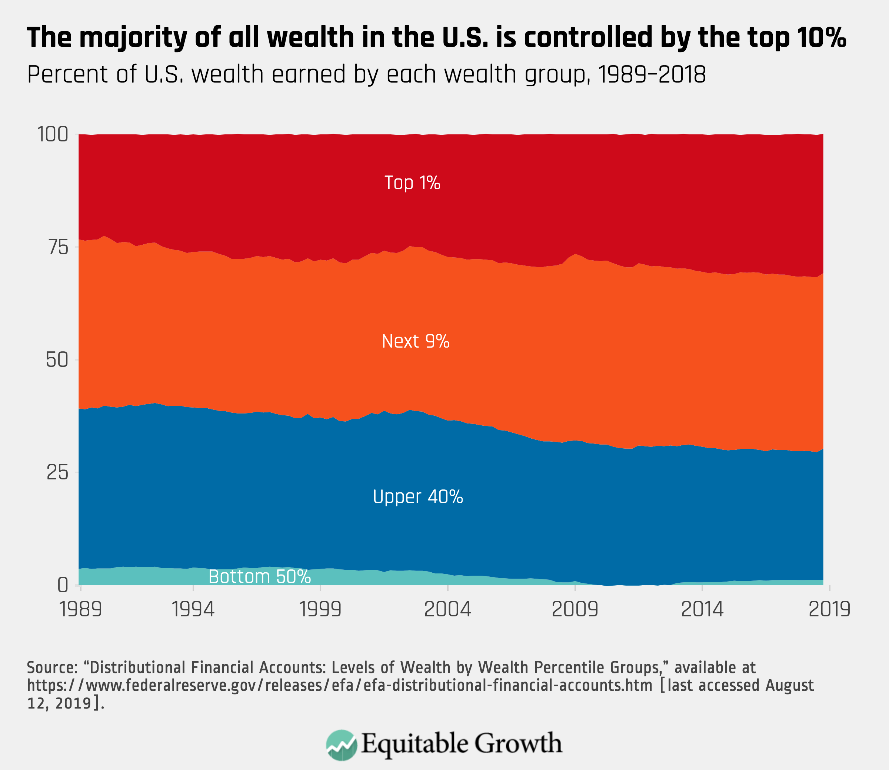
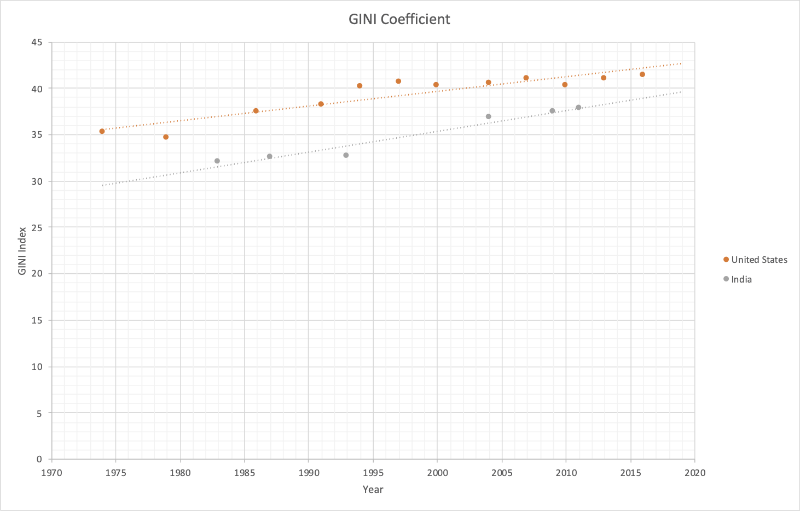
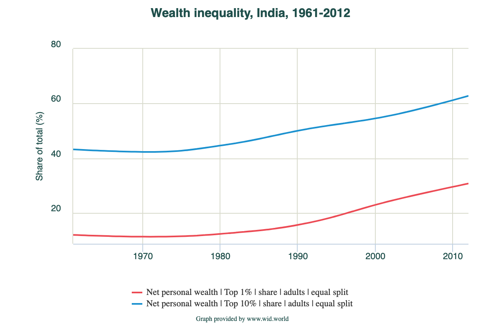

> On the 50th Anniversary, Earth has received an unexpected gift from us humans – the gift of slowing down! 
> But sadly, the reason behind the slowing of our economic engines 
> is an unprecedented threat to human health, and not the benign objective of saving *Gaia*.

*-- Vaishali Kushwaha*

----

  Fight against the COVID-19 virus has transformed the world. 
Countries and cities rushed to first curtail travel, then contain infected people, 
and finally to close businesses and direct people to stay at home. 
The decision to stop movement and drastically limit economic activity was an extraordinary disaster response 
to contain the spread of COVID-19 and reduce the death toll. 
Though on one hand this profound change has brought widespread job losses and tumbling stock markets, 
it also led to some unexpected environmental consequences. 

[Social media is inundated](https://www.nytimes.com/2020/04/15/magazine/quarantine-animal-videos-coronavirus.html) 
with images of [wildlife freely venturing](https://www.youtube.com/watch?v=ysGGIxxrwuk) 
into quiet streets of previously bustling cities. In India, water in Ganges, one of the most 
[polluted rivers, is flowing cleaner](https://www.bloombergquint.com/coronavirus-outbreak/lockdown-health-of-river-ganga-improves) 
and [thickest of smog has cleared out](https://matadornetwork.com/read/indias-heavily-polluted-city-skies-cleared-amid-coronavirus-lockdown/). 
NASA’s satellite sensors observed 
[airborne particle levels plummet in Northern India](https://earthobservatory.nasa.gov/images/146596/airborne-particle-levels-plummet-in-northern-india), 
they are at a 20-year low for this time of year. Energy demand and CO2 emissions are falling across the 
largest emitters in the world. The latest analysis shows that the COVID-19 slowdown could trigger 
[the largest ever annual fall](https://www.carbonbrief.org/analysis-coronavirus-set-to-cause-largest-ever-annual-fall-in-co2-emissions), 
more than during any previous economic crisis or period of war. However, these are temporary effects of a 
disaster response and not a long-term or sustained reduction in human impact on the environment.

> **Today’s clear skies, blue water and flourishing nature is only a glimpse of what we can accomplish when 
> policymakers and individuals make a conscious and sustained effort to reduce their environmental footprint.**

A global pandemic which is taking away life and livelihood of millions of people is no way to bring about 
environmental change. Nevertheless, the COVID19 induced economic slowdown is a natural experiment that has 
shown the strain that humanity has put on the environment and ecosystems around us. Moments of turmoil and 
crisis often open up the windows of opportunity for making long-term policy changes. 
I believe COVID-19 induced widespread reduction in economic activity and human consumption 
should be seen as an opportunity to revisit our common social-environmental priorities. 

> **The world is in need of an economic transformation, one that is not focused 
> only on economic growth but one that promotes both the sustainable wellbeing of individuals and environment.**
 

[Neoclassical economics](https://en.wikipedia.org/wiki/Neoclassical_economics) fosters a ‘growth forever’ 
paradigm, where firms keep producing and consumers keep buying that results in consistent 
growth of income and expenditure. However, this model studies the economy in isolation with humans and natural resources as 
merely a factor of production, and environmental impact as an externality. In reality, economy  is a system within the society 
and the ecosystem or biosphere of earth **(Figure 1)** and hence it can grow only within the planetary boundaries. 
Moreover, neoclassical economics led capitalism is almost solely concerned about efficient allocation of 
resources and it overlooks the social equity and environmental sustainability aspects of development. 

>**COVID-19 induced slowdown provides an opportunity for the mature economies to change their goal 
>from economic growth to wellbeing at steady-state economy[^1]. For developing economies, it is urgent 
>reminder that GDP growth alone is not a true measure of human well-being.**

||
**Figure 1. Limits to Economic Growth: Economy is a system within the society & biosphere** |

## Goal 1: Reduce Consumption
Consumption driven economic growth is threatening the former abundance of natural goods and services. 
As the world’s economy continues to grow it continues to consume large amounts of natural resources and 
degrade the environment beyond repair. The rate of natural resource extraction has accelerated since 2000 
**(Figure 2)**. [The global material footprint](https://unstats.un.org/sdgs/report/2019/goal-12/) rose from 
43 billion metric tons in 1990 to 54 billion in 2000, and 92 billion in 2017—an increase of 70 per cent since 2000. 
The material footprint per capita has also increased at an alarming rate. 

|  |
**Figure 2. Population, Material Footprint and GDP Growth Index, 2000 – 2012** (Data Source: UN Statistics Division) |

People in rich countries consume disproportionately much more than people in poorer counties **(Figure 3)**, 
moreover the lifestyles of people in the richest nations are heavily dependent on resources extracted 
from poorer countries. However, the largest change in 
consumption pattern happened in the [upper-middle income countries](https://unstats.un.org/sdgs/report/2019/goal-12/), 
followed by the lower-middle income countries. Here the per-capita material consumption 
almost doubled between 2000 and 2017. In a globalized economy where companies continue to view 
emerging economies as potential markets, and people there strive to emulate the materialistic lifestyle 
promoted by the rich – economic growth and environmental degradation will continue to rise.

|  | 
**Figure 3. Material Footprint per Capita, 2000 and 2017** (Data Source: UN Statistics Division)|

Proponents of [green growth](https://www.oecd.org/greengrowth/) , 
[circular economy](https://reports.weforum.org/toward-the-circular-economy-accelerating-the-scale-up-across-global-supply-chains/from-linear-to-circular-accelerating-a-proven-concept/), 
[low-carbon economy](https://www.wri.org/blog/2018/09/low-carbon-growth-26-trillion-opportunity-here-are-4-ways-seize-it)  
perpetuate the idea that economic growth and sustainable development can go hand-in-hand. 
Even though these paradigms aim at improving resource efficiency, the core paradigm remains economic growth. 
At [global scale decoupling](https://unstats.un.org/sdgs/report/2019/goal-12/) of economic growth and natural resource use has not happened yet. 
Even if improvement in resource efficiency reduces the footprint of a product, increase in consumption of 
that product can nullify the efficiency improvement gains. Hence, proponents of no-growth and steady-state 
economy fear that green growth economy can be much bigger than the currently practiced brown growth economy. 
The false comfort of consuming green products can in turn increase the total consumption, resulting in a 
larger material footprint. 

As long as the sense of development and richness continues to be attached to consumption of resources, our 
impact on ecosystems and environment is not going to change. 

>**COVID-19 shut down has limited our access to 
non-essential goods and travel, and as a result has inadvertently reduced our consumption of material and 
energy. We can continue this change in our behavior even as the shutdown ends and the economy opens. 
It is imperative that we disconnect the sense of growth, success and development from materialistic 
consumption.** 

## Goal 2: Reduce Inequality
As the world economies and many world leaders focus on GDP growth, income inequality continues to rise. 
GDP growth alone is not an indicator of distribution of progress among the people. In the US, [income inequality has been rising](https://equitablegrowth.org/eight-graphs-that-tell-the-story-of-u-s-economic-inequality/) since the last 40 years **(Figure 4(a)**). In 2018, the top 20% of the population earned 52% of all U.S. income. The richest of the rich, the top 5%, earned 23% of all income. 

|   
**Figure 4 (a). Rapidly increasing income inequality in USA** [source](https://equitablegrowth.org/eight-graphs-that-tell-the-story-of-u-s-economic-inequality/)|

In terms of wealth, just 1 in 100 Americans now own 31 percent of all wealth in the country, 
and the top 10 percent owns 70 percent of all wealth **(Figure 4(b))**.

|  
**Figure 4 (b) Wealth concentration in USA** [source](https://equitablegrowth.org/eight-graphs-that-tell-the-story-of-u-s-economic-inequality/)|
 
Similarly, in India, one of the fastest growing economies, inequality has been rising 
for the last 30 years but worsened significantly in the 2000s **(Figure 5)**. In 2015, the top 10% earned 56.1% 
of the total income while the richest of rich 1% earned 21.3% income. 

|  | 
**Figure 5. GINI Coefficient of USA and India** [Date Source](https://data.worldbank.org/indicator/SI.POV.GINI?locations=US) | 

The wealth inequality has also been rapidly rising **(Figure 6)**, and in 2012 top 10% held 62.8% of the total wealth.

| | 
**Figure 6. Wealth inequality in India** [Source](https://wid.world/country/india/) |

[Evidences suggest](https://www.theguardian.com/inequality/2018/sep/18/kate-pickett-richard-wilkinson-mental-wellbeing-inequality-the-spirit-level) 
that income inequality leads to higher rates of health and social problems
and lower rates of social goods. Preliminary data has shown that COVID-19 deaths in the US are closely 
related to socioeconomic status. Marginalized people are at greater risk of chronic diseases and infections than 
the richer people, and hence have far greater mortality rates in the ongoing pandemic. 
On one hand [COVID-19 has exacerbated the existing health disparities](https://www.vox.com/2020/4/10/21207520/coronavirus-deaths-economy-layoffs-inequality-covid-pandemic) 
that have their roots in structural racism and economic inequality, and on the other it has resulted in 
layoffs of the most vulnerable low-wage workers. This crisis once again highlights that the poor and 
economically weak are at disproportionately higher risk in any disaster. 

>**Reducing inequality, by redistribution of resources and opportunities, is a critical step towards 
increasing resilience. [States have the responsibility to reduce the risks faced by poor people](https://www-cdn.oxfam.org/s3fs-public/file_attachments/bp172-no-accident-resilience-inequality-of-risk-210513-en_1_0.pdf) 
>and ensure that they are borne more evenly across society.** 

Less unequal societies also tend to be stronger  communities, with lower crime rate, more economic stability and better health. 
Distribution must focus on income and wealth and on market and non-market goods. 
Though many see inequality as the inevitable side effect of capitalism, public policy experts believe 
government interventions ([USA](https://belonging.berkeley.edu/six-policies-reduce-economic-inequality)
and [India](https://donate.oxfamindia.org/sites/default/files/WideningGaps_IndiaInequalityReport2019.pdf))

The COVID-19 stay-at-home orders have given many of us the opportunity to redefine our priorities and 
happiness. On this 50th Earth Day, which marks a historic people’s movement for the protection of the environmental protection, 
it is once again up to us to redefine our societal and economic priorities.

>**We can emerge out of our current crisis more sustainable and resilient where governments work towards 
>reducing inequality and citizens work towards minimizing consumption.** 

[^1]:Though the ecological economics paradigm of [steady-state economy](https://steadystate.org/discover/definition/), [Managing without growth](https://www.amazon.com/Managing-Without-Growth-Ecological-Economics/dp/184844205X), [Degrowth](https://degrowth.org/short-history/) has been around for decades, these ideas have started gaining traction more recent years. In 2018, over 200 scientists signed an open letter [“Europe, It’s Time to End the Growth Dependency”](https://degrowth.org/2018/09/06/post-growth-open-letter/) to the EU institutions urging them to explore alternate frameworks for a post-growth economy.

